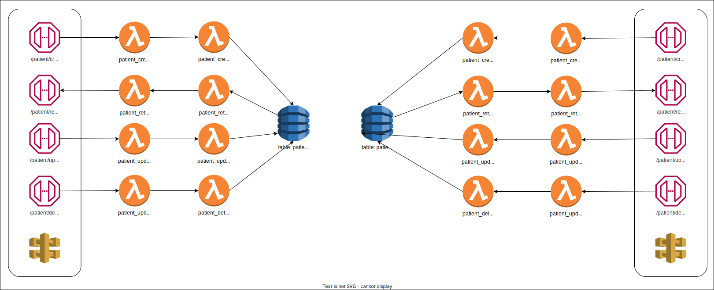

# HospitalManagementAWS

This project will re-create the project found in my HospitalManagement repository but in aws.<br>
See original project link <a href="https://github.com/justirack/HospitalManagement">here</a> <br>
The project will use APIGateway to create the endpoints where requests will be sent, and will be backed by lambda functions. Data will be stored in multiple dynamoDB tables, with one for each of patients, doctors and appointments respectively.

# Tentative Architecture
The following draw.io diagram contains the initial architecture diagram for patients and doctors. The diagram will be updated to include appointments once patients and doctorsare complete.




# Endpoint Request Specifications
## patient/add
The add patient endpoint expects the patients first name, last name and date of birth in <code>yyyy-mm-dd</code> format.<br>
See sample json below:
 
``` json
{
  "first_name":"Justin",
  "last_name":"Rackley",
  "date_of_birth":"2002-02-09"
}
```
